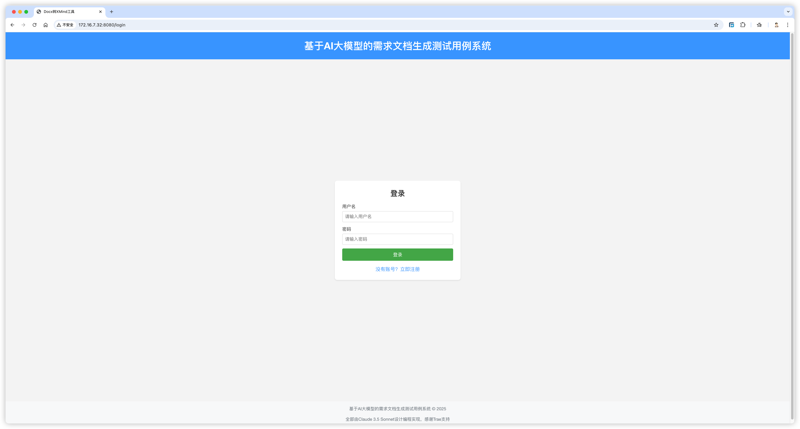
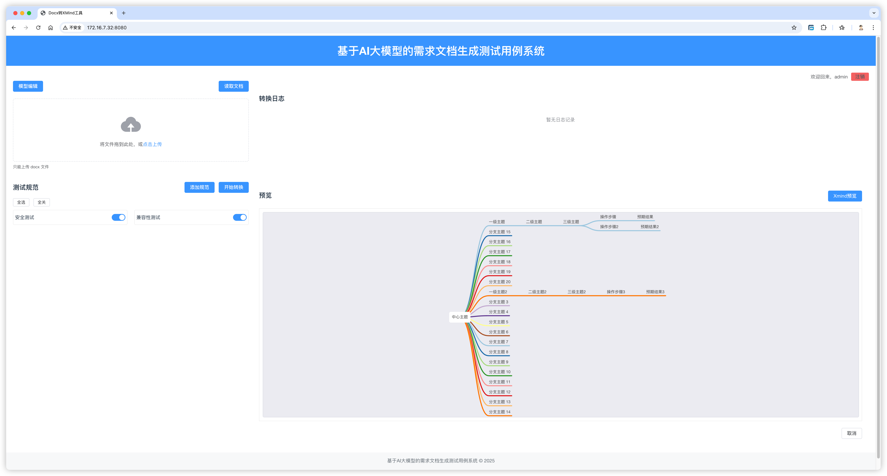

### 仍在开发中，页面已搭好，正在逐步完善请求逻辑。

# Docx 转 XMind 工具

基于大模型的 docx 文档转 xmind 思维导图工具，实现文档结构智能解析与思维导图生成。





## 项目结构

```
├── backend/             # 后端Flask应用
│   ├── api/            # API模块
│   │   ├── docx_parser.py    # docx解析模块
│   │   ├── model_api.py      # 大模型API调用模块
│   │   └── xmind_generator.py # xmind生成模块
│   ├── app.py         # Flask应用主文件
│   ├── static/        # 静态资源
│   │   ├── outputs/   # 生成的xmind文件
│   │   └── uploads/   # 上传的docx文件
│   └── utils/         # 工具函数
└── frontend/          # 前端Vue应用
    ├── public/        # 公共资源
    └── src/           # 源代码
        ├── assets/    # 静态资源
        ├── components/ # 组件
        ├── router/    # 路由
        └── views/     # 页面
```

## 功能特点

- **文件上传**：支持拖拽或点击上传docx文件
- **API配置管理**：可添加多个大模型API配置
- **测试规则**：支持多种测试规则，确保转换质量
- **实时日志**：显示转换过程中的详细日志
- **预览功能**：转换完成后可预览思维导图结构
- **下载功能**：支持下载生成的xmind文件

## 安装与运行

### 环境要求

- Python 3.6+
- Node.js 12+

### 后端安装

```bash
# 安装依赖
pip install -r requirements.txt

# 启动后端服务
python backend/app.py
```

### 前端安装

```bash
# 进入前端目录
cd frontend

# 安装依赖
npm install

# 启动开发服务器
npm run serve

# 构建生产版本
npm run build
```

## 使用说明

1. **配置API**：点击左上角"编辑"按钮，添加大模型API的Key和URL
2. **上传文件**：拖拽或点击上传区域选择docx文件
3. **选择测试规则**：根据需要开启或关闭测试规则
4. **查看转换日志**：右侧日志区域实时显示转换过程
5. **预览思维导图**：转换完成后可在预览区查看结果
6. **下载xmind文件**：点击"下载"按钮保存生成的xmind文件

## 注意事项

- 支持的文件格式仅限于.docx
- 文件大小限制为16MB
- 需要正确配置大模型API才能使用转换功能
- 转换质量取决于文档结构和大模型的能力

## 技术栈

- 前端：Vue 3 + Element Plus
- 后端：Flask
- 文档解析：python-docx
- 思维导图生成：xmind

## 待办

- [ ] 转换接口
- [ ] 文档解析
- [ ] 模型调用
- [ ] 规范存储
- [ ] 预览内容
- [ ] xmind在线编辑
- [ ] 文档下载
- [ ] 失败重试


```
echo "# demo" >> README.md
git init
git add README.md
git commit -m "first commit"
git branch -M main
git remote add origin https://github.com/wbbk/docx2xmindtool.git
git push -u origin main
```